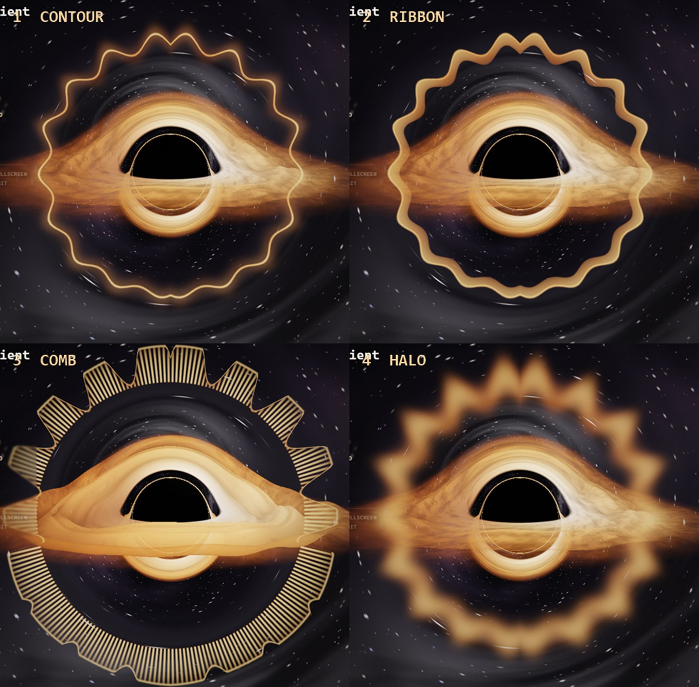

# Black Hole Visualizer

A relativistically ray-traced black hole that reacts, in real time, to whatever your
computer is playing — Spotify, YouTube, a game, anything that comes out of the speakers.

It can run as your **actual desktop wallpaper**: reparented into Explorer's wallpaper
layer, so your icons stay on top and keep working, clicks fall through to the desktop,
and it never shows up in Alt+Tab or the taskbar.

It reads whatever your media player is doing, shows **synced lyrics** in time with the
song, and can put your **desktop shortcuts into orbit** around the hole as clickable
bodies.


---

## Quick start

```powershell
git clone https://github.com/brunovieira01/blackhole-visualizer.git
cd blackhole-visualizer
powershell -ExecutionPolicy Bypass -File setup.ps1
```

That installs the dependencies, builds the icons, and drops a **Black Hole Visualizer**
shortcut on your Desktop. Double-click it and the black hole becomes your wallpaper.

Add `-Startup` to have it come back on every login — or tick **Start with Windows** in
the tray, which does the same thing. Either way it's a shortcut in your Startup folder,
which you can delete by hand; the app notices and updates the tray to match.

Everything else lives in the **tray icon** next to the clock. No window to keep open,
nothing to babysit.

Prefer not to use the setup script? `npm install`, then double-click
`Start Black Hole.vbs` — it launches with no console window at all.

---

## The three modes

| Mode | What it does |
|---|---|
| **Desktop wallpaper** *(default)* | Becomes the literal wallpaper. Desktop icons stay on top and stay clickable — or [go into orbit](#the-orbit-launcher) if you'd rather. Win+D reveals it instead of hiding it, no taskbar entry. |
| **Overlay** | Fullscreen, always on top, click-through. Alpha follows luminance, so only the glow is drawn and the rest of your screen shows through. |
| **Window** | An ordinary window. Drag to orbit the camera, and you get a HUD with the current state. |

Switch between them from the tray menu. `Ctrl` + `Alt` + `B` toggles it on and off from
anywhere.


---

## Now playing

The panel in the top-left names whatever is making sound, in the visualiser's own type.
It reads the same media session that backs the Windows volume flyout
(`Windows.Media.Control`), so it gets **title, artist and app** from Spotify, YouTube in
a browser, VLC, Groove and most media apps — no accounts, no API keys, nothing to log
into.

When something is playing that has no media metadata at all — a game, a call, a random
video player — it falls back to enumerating the **WASAPI render sessions** and naming the
process actually pushing audio, so you still get "Valorant" or "Discord" instead of a
blank.

Five small bars beside the title ride the live spectrum, and there's a progress bar with
elapsed / total time. Turn the whole thing off with `N` or from the tray.

### Controls

Play/pause, previous and next are wired straight through to the same media session, so
they drive Spotify, YouTube, VLC — whatever currently holds it. Clicking the progress bar
seeks, where the app supports it.

Below the transport is the **system volume** — the same master level the taskbar speaker
drives, read and set through `IAudioEndpointVolume`. Click the bar to set it, the speaker
to mute. It's in the tray as well, under the audio source.

The buttons work in every mode, including as the wallpaper — see
[Clicking a wallpaper](#clicking-a-wallpaper) for why that takes any effort at all.

Global hotkeys, which work from anywhere regardless of mode:

| | |
|---|---|
| `Ctrl` `Alt` `Space` | Play / pause |
| `Ctrl` `Alt` `→` | Next track |
| `Ctrl` `Alt` `←` | Previous track |

In overlay mode the panel becomes clickable only while the pointer is actually over it —
the rest of the screen stays click-through.

---

## Lyrics

When a track has synced lyrics they fade up along the bottom of the screen and follow
the song line by line, with the previous and next lines dimmed above and below.

They come from [LRCLIB](https://lrclib.net) — a free, open, key-less database of LRC
files. Spotify has no public lyrics API; what its own client shows comes from Musixmatch
through an internal endpoint that needs a token lifted out of the web player, which is
both against their terms and permanently one deploy away from breaking. LRCLIB matches on
exactly what the Windows media session already gives us — artist, title, album and
duration — and it works for any player, not just Spotify.

**Timed lyrics only.** An unsynced upload is the entire text of the song with nothing to
say about when any of it happens; on screen that's a wall of words that never changes and
never matches what you're hearing, so it isn't shown at all. A candidate whose length
differs from the track by more than five seconds is rejected too — it's a different
master, and words that drift a few seconds off are worse than no words.

Three things go into getting the timing right:

- The **`[offset:]` tag** in the LRC file is honoured. It's part of the format and often
  non-zero — it's how a file corrects for a lead-in that doesn't match the master it was
  timed against — and ignoring it shifts the whole song.
- The **playback clock is smoothed, not reset.** The watcher reports a position about
  once a second and many players round it to whole seconds; adopting each reading whole
  makes lines stutter and land up to a second late. Small disagreements are eased out
  and only a real jump (a seek, a track change) resyncs hard.
- **Lyrics timing** in the tray shifts everything earlier or later, because how far ahead
  a line should appear is taste and player latency varies. The default shows each line a
  quarter-second early, which is what karaoke does — you want to read it just before it's
  sung.

Nothing to sign into, and `L` or the tray turns it off.

### When they look wrong

`npm run probe-lyrics` prints, for whatever is playing right now, the track as Windows
reports it, the LRCLIB record that was matched, and the line that would be on screen with
its neighbours. Three different problems all look like "the lyrics are wrong", and it
tells them apart:

| What you see | What it is | Fix |
|---|---|---|
| Lines start from the top of the song and stay behind | The player's reported position isn't advancing — the probe shows it frozen | Fixed; if it comes back, that's the timeline interpolation |
| Right words, consistently early or late by the same amount | Player latency | **Lyrics → Timing** in the tray |
| Right words, drifting further out as the song goes on | A different master was matched — a remaster or single edit, timed against a different recording | Nothing to tune; the duration check rejects anything more than 5s off, but a 2s difference still drifts |
| Different words entirely | Wrong match, usually a cover or a live version with the same title | — |

The one thing it can't be is the line *selection*: that runs off the position Windows
reports, and is checked against known timestamps in `npm run test:lyrics`.

---

## Clicking a wallpaper

A window inside Explorer's `WorkerW` **cannot receive mouse input**. The desktop's own
`SHELLDLL_DefView` listview sits above it and swallows every click. That isn't something
window styles can fix — it's how the shell is layered, and it's why Lively and Wallpaper
Engine both *forward* input to their wallpapers instead.

So this does the same. The main process samples the global cursor (`GetCursorPos`,
`GetAsyncKeyState`, `WindowFromPoint`), works out whether the pointer is over the desktop
rather than over some app window, and sends that to the renderer as synthetic hover and
click events. **Nothing is hooked and nothing is injected**, so no other application is
affected and nothing is intercepted from anything else — it only ever *reads* where your
mouse already is.

Two details fall out of that:

- **The orbit holds still while your cursor is on the desktop.** You cannot reliably click
  a moving target, so the ring pauses the moment the pointer is over the desktop and
  resumes when it leaves.
- **Right-click is deliberately ignored.** Since nothing is swallowed, Explorer still
  opens its own desktop menu; putting a second menu next to it would be worse than having
  none. Left-click is safe — on an empty desktop it does nothing Explorer cares about.

---

## The orbit launcher

Turn on **Orbit launcher → Put desktop shortcuts in orbit** and your Desktop becomes a
set of bodies circling the hole: the real shell icon for each shortcut on a dark disc,
labelled, lit with the current theme's accent, and clickable. They ride an ellipse
flattened to match the accretion disk, so the ring reads as an orbital plane rather than
a circle drawn on the glass — near-side bodies are larger and brighter, far-side ones
shrink and dim as they pass behind.

- Spacing is by **arc length**, not by angle. On an ellipse this flat, equal angles bunch
  bodies at the left and right extremes — exactly where the labels are widest — and
  string them thin across the top and bottom.
- More than fourteen shortcuts split into **two rings** at different radii and speeds, so
  labels stay readable.
- Icons are resolved through the shortcut to the **target's** icon, because
  `getFileIcon()` on a `.lnk` hands back the generic shortcut glyph more often than not,
  and a desktop full of blank pages is not much of a launcher.
- They're then **tinted to the theme**, because a desktop's worth of app logos is a
  scatter of unrelated brand colours that reads as a toolbar rather than as bodies in
  orbit. Hovering one shows its true colours. Off in the tray if you'd rather.
- The ring **lifts clear of the lyrics** when they're on screen, measuring the block
  rather than assuming a height, and it squashes symmetrically so it stays an ellipse.
- Size and speed are in the tray; **Still** parks the ring if you'd rather it didn't move.

By default it also **hides the real desktop icons**, since having both is just clutter.
That's the same toggle as right-click → View → Show desktop icons, so you can always put
them back by hand. The app restores them when it quits, and if it's killed outright it
remembers on disk that it hid them and puts them back on next launch.

It's **off by default**: a fresh clone should never empty someone's desktop unannounced.

---

## Motion

There are two kinds of movement here, and keeping them apart is the whole design.

**Ambient drift** is slow, continuous and completely independent of the audio: the camera
creeps around the hole (about six minutes for a lap), the tilt breathes, the two star
layers parallax against each other, and the nebula churns. None of it is synced to
anything, so it reads as drifting through space.

**Audio reactivity** is confined to the disk. Nothing in the composite pass reacts at all.

Every audio-driven term that moved the *whole frame* — a camera dolly on bass, a per-beat
shake, chromatic aberration and bloom gain pumped by the music, a throbbing photon ring,
a starfield that flickered on hi-hats — is gone. That combination is what made it
nauseating; a fixed frame with a moving disk is not. Ambient drift is a *Slow / Barely
there / Wandering / Off* dial in the tray.

---

## Where the audio comes from

The renderer asks for `getDisplayMedia`, and the main process answers with
`audio: 'loopback'` — Electron's hook into **WASAPI loopback**. That's the system audio
mix, straight from Windows. No Stereo Mix, no VB-Cable, no virtual audio device, and
nothing is routed back out through your speakers.

If loopback is unavailable it falls back to a synthetic beat, so the visuals never sit
there dead. The tray menu shows which source is live.

### It never touches your microphone

Loopback captures a *render* endpoint. Windows doesn't treat that as microphone access:
no mic-in-use indicator, no privacy prompt, and no contention with anything else using
your mic.

That's the only source used by default, deliberately. Input devices — Stereo Mix
included — count as microphone use no matter how loopback-ish the device name is, so
they're behind **Allow microphone input** in the tray, which is off unless you turn it on.

This was a real bug, not a hypothetical. An earlier version probed
`getUserMedia({audio: true})` — the default microphone — just to reveal device labels
while looking for Stereo Mix, and it re-ran that probe on every `devicechange`: every
headset plug, every default-device switch, every meeting join. It also matched a bare
`stereo`, which would happily select a headset called "Stereo Microphone". Both are gone,
and `tools/test-capture.mjs` fails if either comes back.

**Changing output device** — plugging in headphones, switching the default — is handled
automatically. It has to be: a loopback stream orphaned by a device switch doesn't error
or end, it just returns perfect digital silence forever, which is indistinguishable from
a quiet room. So capture is re-acquired on `devicechange`, on the track ending or muting,
and on a 20-second all-zero watchdog as a backstop.

### Hearing the quiet things too

Music spectra fall off steeply with frequency — in raw terms a kick sits about **7x**
higher than a hi-hat — so a naive FFT readout makes any visualiser all bass and no
detail. Instead, every one of the 256 log-spaced bins carries its own adaptive floor and
ceiling and is normalised between them, with a gate on the absolute level so a silent
bin's noise floor never gets stretched into a signal.

The result, from `npm test`:

```
full mix             bass=0.761  mid=0.716  treble=0.593   <- within 1.28x
bass only            bass=0.755  mid=0.000  treble=0.000
treble only (quiet)  bass=0.000  mid=0.000  treble=0.640   <- 36 dB down, still full swing
silence              bass=0.000  mid=0.000  treble=0.000
```

Onsets are detected by **spectral flux** — the summed positive change across the whole
spectrum — rather than bass energy, so snares, hats, plucks and vocal attacks trigger the
visuals just like kicks do.

---

## What's actually being rendered

Photons around a Schwarzschild black hole follow the Binet equation for null geodesics,

$$u'' + u = \tfrac{3}{2}\, r_s\, u^2$$

which in Cartesian form (with $r_s = 1$) integrates as

```glsl
vec3 acc = -1.5 * h2 * pos / pow(dot(pos, pos), 2.5);   // h = |p × v|, conserved
vel += acc * dt;
pos += vel * dt;
```

Every pixel marches its own ray through that field, which gives the real geometry for
free: the event horizon at $r = 1$, the photon sphere at $r = 1.5$, the Einstein ring,
and the disk's far side lensed up over the top and down under the bottom. Crossings of
the equatorial plane are detected by sign change and shaded as an optically-thin
accretion disk with Keplerian shear, relativistic beaming, Doppler tinting, and
gravitational redshift.

Then the audio goes in, in two layers.

### The disk

The accretion disk isn't a flat plane: its height is a function of the audio, so the
whole sheet moves. The marcher tracks the signed distance to that moving surface rather
than to `y = 0`.

The shape is a sum of **azimuthal vibration modes**, like a drum head, and that choice is
what makes it legible. Wrapping a raw audio waveform around the disk — the obvious first
idea — fails, because an audio waveform is high spatial frequency: you get fine
corrugation that reads as fuzz, and you're forced to keep the amplitude tiny to stop it
smearing the disk into a blob. A handful of low-order modes gives big coherent lobes you
can actually follow, so the amplitude can be several times larger.

Bands are separated by both mode number and radius, so instruments stay tellable apart:

| Band | Modes | Where | Reads as |
|---|---|---|---|
| Bass | 2, 3 lobes | inner disk | kick and bassline — slow heaving |
| Mid | 5, 7 lobes | mid radii | voice and melody — rolling undulation |
| Treble | 11, 15 lobes | outer edge | hats and transients — fine shimmer |

On top of that, the spectrum drives a swell travelling outward in radius (this carries the
punch of a kick), and a little raw waveform is layered in for texture. The modes drift at
different rates and phases so the pattern never freezes into a standing wave.

| Signal | Also drives |
|---|---|
| Surface slope | Sheen and crest/trough shading — what makes the wave readable edge-on |
| Bass | Brightness of the inner disk |
| Mids | Turbulence in the disk filaments |
| Level | How fast the disk turns |
| Onsets | A gentle swell through the disk |

The warp is held rigid across the inner rim, where the photon ring and the lensed arc are
drawn — rippling it costs far more in crispness than it buys in motion. Depth is a
*Wave depth* dial in the tray, from off to turbulent.

### The ring

One shape, not two. The spectrum and the waveform are a **single closed contour** whose
radius carries both — the spectrum gives the large lobes, the waveform rides on top as
fine wobble. Bass sits at 12 o'clock and sweeps round to treble at 6, mirrored across the
vertical axis so the curve closes seamlessly, and the colour runs cool at the bass end to
hot at the treble end: a literal temperature gradient around the ring.

Four ways of drawing that same curve, in the tray:

| | |
|---|---|
| **Contour** | a single glowing line with a soft bloom skirt |
| **Ribbon** | a thick band of light following the curve |
| **Comb** | short discrete bars, capped by the contour so it still reads as one object |
| **Halo** | a soft band centred on the curve, no edges anywhere |



It's drawn into the *scene* buffer rather than over the finished frame, which matters for
two reasons: the bloom pass picks it up, so it reads as emitted light sharing the disk's
glow instead of flat UI sitting on top; and the scene can occlude it, so the disk passes
in front and the ring genuinely sits around the black hole in space.

### The sky

A galactic arm crosses the frame at an angle to the disk, with dark dust lanes cut
through it — those lanes are what make a star cloud read as the Milky Way rather than a
bright smudge. Star density rises inside the arm, and three nebulae drift: a large violet
complex plus two smaller ones with emission-red and reflection-blue cores. It's all built
from contrast rather than brightness: the average stays near black so the background never
greys out behind the disk, and the near-black gaps between the nebula filaments are what
stop it becoming a coloured wash.

Nothing up there is a fixed colour. The arm and the big nebula take their hue from the
current theme, and the arm is coloured *by density* — thin outskirts hold the theme hue,
dense cores brighten and warm. It used to be a flat neutral grey, which is exactly what
made the sky read as a white smear: the brightest part of it had no hue at all.

**Stars are not white dots.** Their colour follows the blackbody curve set by surface
temperature — the spectral classes: M red, K orange, G yellow (our Sun), A white, B/O
blue. The sampled distribution is deliberately pushed away from the middle of that ramp,
because a uniform sample puts most stars in the white classes where they all look the
same. A sparse third layer scatters a few brighter giants, the ones you actually notice
in a real sky. They're kept moderate rather than blazing: ACES desaturates highlights, so
an overdriven star tonemaps to white and the colour is lost — the bloom carries the hue
instead.

Post: HDR half-float targets → bright pass → two ping-pong gaussian blurs → ACES tonemap,
vignette, and grain.

It's a single fullscreen triangle and about 350 lines of GLSL. No three.js, no build
step, no bundler.

---

## Performance

Quality defaults to **Auto**, which measures the frame rate every second and trades
render scale and integration steps to hold ~60 fps. Fixed Low/Medium/High/Ultra presets
are in the tray menu if you'd rather pin it.

With **Idle down when silent** on (the default), the visualizer drops to ~12 fps after
six seconds of silence and snaps straight back on the next sound, so it isn't burning
your GPU on a still image all day.

---

## Keyboard (window mode)

| Key | |
|---|---|
| `1` – `6` | Theme |
| `H` | Toggle HUD |
| `N` | Toggle the now-playing panel |
| `O` | Toggle the orbit launcher |
| `L` | Toggle lyrics |
| `space` | Play / pause |
| `,` `.` | Previous / next track |
| `↑` `↓` | Reactivity |
| `←` `→` | Wave depth (off → subtle → normal → strong → turbulent) |
| `F` | Fullscreen |
| drag | Orbit the camera |
| `Esc` | Hide to tray |

Themes: Gargantua, Cygnus X-1, Nova, Emerald, Ember, Monochrome.

---

## Layout

```
main.js                 Electron main: modes, tray, config, loopback plumbing
preload.js              The (small) IPC bridge
native/wallpaper.js     WorkerW reparenting via koffi — the live-wallpaper trick
native/desktop.js       Desktop icon toggle + global pointer sampling
lib/desktop-items.js    Reads the Desktop and resolves shortcut icons
lib/lyrics.js           LRCLIB client and LRC parser
src/shaders.js          GLSL: geodesic ray marcher, bloom, composite
src/renderer.js         WebGL2 pipeline and render targets
src/audio.js            Loopback capture, per-bin normalisation, onset detection
src/orbit.js            The orbiting launcher: layout, hit-testing, both input paths
src/app.js              Bootstrap, adaptive quality, now-playing panel, lyrics, input
tools/nowplaying.ps1    Media session (SMTC) + WASAPI + endpoint volume watcher
tools/fake-track.js     A silent but completely real media session, for testing
tools/probe-desktop.js  Read-only diagnostics for the shell's desktop layer
tools/shot-wallpaper.js PrintWindow capture of the live wallpaper, covered or not
tools/make-icon.js      Draws assets/icon.png + icon.ico from scratch
tools/test-analysis.mjs Asserts the spectrum stays balanced (npm test)
tools/test-capture.mjs  Pins the capture chain's microphone contract (npm test)
tools/test-lyrics.mjs   LRC parsing, plus a live LRCLIB lookup
```

Settings are stored in `%APPDATA%\blackhole-visualizer\config.json`.

### Development

```powershell
npm start                    # last used mode
npm run window               # windowed, with the HUD
npm run wallpaper            # desktop wallpaper mode
npm test                     # analyser balance + microphone contract (no devices needed)
npm run test:lyrics          # LRC parsing, and one live LRCLIB lookup
npm run probe-desktop        # what the shell's desktop layer looks like right now
npx electron . --demo-audio  # synthetic beat, no capture — handy for tuning
npx electron . --mode=window --shot=out.png   # render a frame to a PNG and exit
npx electron tools/fake-track.js              # a silent, real media session to test against
```

`fake-track.js` is how the now-playing panel, the transport and the lyrics get tested
without playing anything audible: Chromium registers a media session for any playing
unmuted audio track without inspecting the samples, so a looping silent WAV with
`mediaSession` metadata gives you a genuine SMTC session. It logs every transport command
it receives, which is what proves the whole chain rather than just that a call returned.

---

## Notes and limitations

- **Windows only.** The wallpaper mode depends on Explorer's `Progman`/`WorkerW`
  windows, which is a Windows-specific (and undocumented) arrangement. Overlay and
  window modes are only tested on Windows too.
- Wallpaper embedding needs [`koffi`](https://koffi.dev) for the Win32 calls. It's an
  *optional* dependency — if it can't install, the app still runs and falls back to a
  bottom-of-the-z-order window, which looks the same but covers desktop icons.
- Third-party wallpaper tools (Wallpaper Engine, Lively) fight over the same WorkerW.
  Run one at a time.
- Lyrics are the only thing here that touches the network, and only to ask LRCLIB about
  the track that's playing. Nothing else leaves the machine; with no connection the rest
  of the app is unaffected.
- Verified on Windows 11 26200 with Electron 43.

## License

MIT
