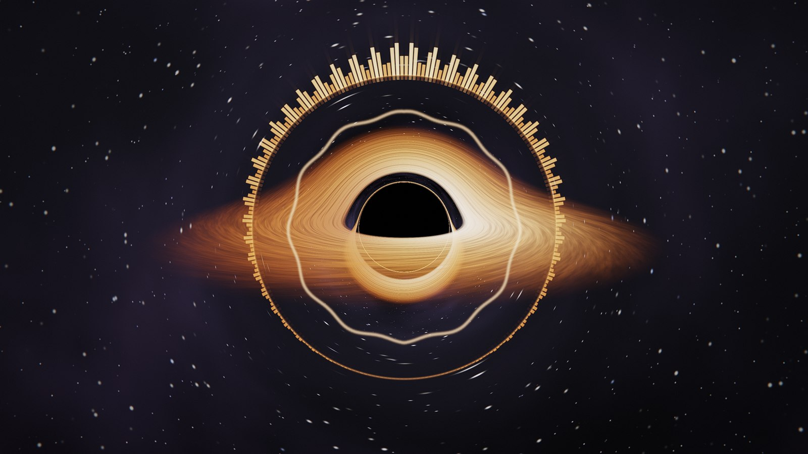
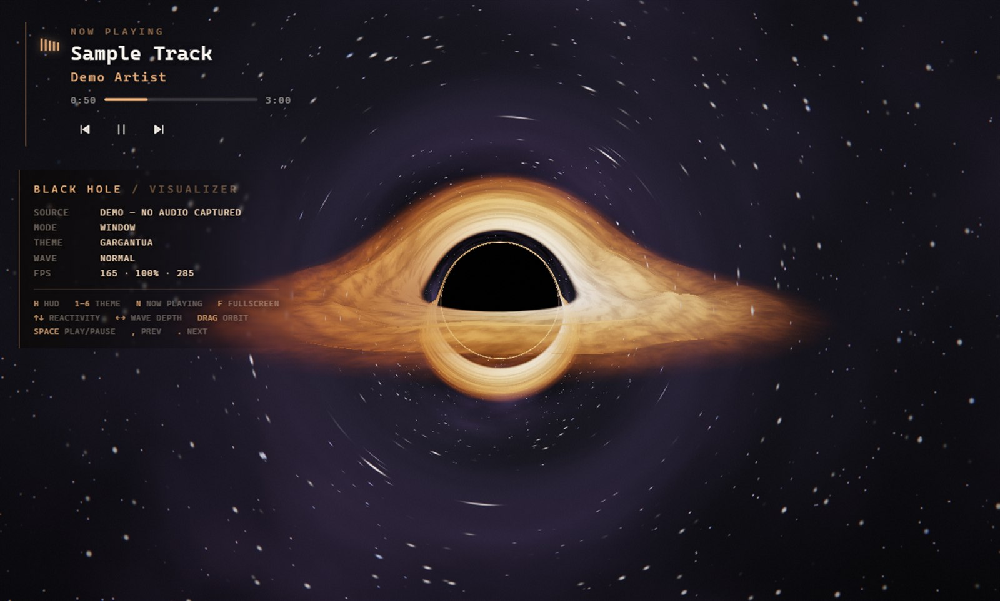

# Black Hole Visualizer

A relativistically ray-traced black hole that reacts, in real time, to whatever your
computer is playing — Spotify, YouTube, a game, anything that comes out of the speakers.

It can run as your **actual desktop wallpaper**: reparented into Explorer's wallpaper
layer, so your icons stay on top and keep working, clicks fall through to the desktop,
and it never shows up in Alt+Tab or the taskbar.



---

## Quick start

```powershell
git clone https://github.com/brunovieira01/blackhole-visualizer.git
cd blackhole-visualizer
powershell -ExecutionPolicy Bypass -File setup.ps1
```

That installs the dependencies, builds the icons, and drops a **Black Hole Visualizer**
shortcut on your Desktop. Double-click it and the black hole becomes your wallpaper.
Add `-Startup` to the setup command if you want it to come back on every login.

Everything else lives in the **tray icon** next to the clock. No window to keep open,
nothing to babysit.

Prefer not to use the setup script? `npm install`, then double-click
`Start Black Hole.vbs` — it launches with no console window at all.

---

## The three modes

| Mode | What it does |
|---|---|
| **Desktop wallpaper** *(default)* | Becomes the literal wallpaper. Desktop icons stay on top and stay clickable, Win+D reveals it instead of hiding it, no taskbar entry. |
| **Overlay** | Fullscreen, always on top, click-through. Alpha follows luminance, so only the glow is drawn and the rest of your screen shows through. |
| **Window** | An ordinary window. Drag to orbit the camera, and you get a HUD with the current state. |

Switch between them from the tray menu. `Ctrl` + `Alt` + `B` toggles it on and off from
anywhere.



---

## Now playing

The panel in the top-left names whatever is making sound, in the visualiser's own type.
It reads the same media session that backs the Windows volume flyout
(`Windows.Media.Control`), so it gets **title, artist and app** from Spotify, YouTube in
a browser, VLC, Groove and most media apps — no accounts, no API keys, nothing to log
into.

When something is playing that has no media metadata at all — a game, a call, a random
video player — it falls back to enumerating the **WASAPI render sessions** and naming the
process actually pushing audio, so you still get "Valorant" or "Discord" instead of a
blank.

Five small bars beside the title ride the live spectrum, and there's a progress bar with
elapsed / total time. Turn the whole thing off with `N` or from the tray.

### Controls

Play/pause, previous and next are wired straight through to the same media session, so
they drive Spotify, YouTube, VLC — whatever currently holds it. Clicking the progress bar
seeks, where the app supports it.

**How you reach them depends on the mode**, and this is a hard constraint rather than a
choice: as the wallpaper the visualiser lives *below* Explorer's desktop icon layer,
which swallows every click on the desktop. Nothing drawn there can ever be clicked.

| | Wallpaper | Overlay | Window |
|---|---|---|---|
| On-screen buttons | hidden (can't be clicked) | yes | yes |
| Tray menu | yes | yes | yes |
| Global hotkeys | yes | yes | yes |

Global hotkeys, which work from anywhere regardless of mode:

| | |
|---|---|
| `Ctrl` `Alt` `Space` | Play / pause |
| `Ctrl` `Alt` `→` | Next track |
| `Ctrl` `Alt` `←` | Previous track |

In overlay mode the panel becomes clickable only while the pointer is actually over it —
the rest of the screen stays click-through.

---

## Motion

The camera does not move. No audio-driven dolly, no beat shake, no drift, and the frame
as a whole never reacts — bloom gain, chromatic aberration, the photon ring and the
starfield are all constant. Everything that displaces or flashes the whole image in time
with the music reads as the screen lurching, which is genuinely unpleasant on something
you have open all day.

Only the **disk** moves. If you want the slow orbit back, there's a *Slow camera drift*
checkbox in the tray.

---

## Where the audio comes from

The renderer asks for `getDisplayMedia`, and the main process answers with
`audio: 'loopback'` — Electron's hook into **WASAPI loopback**. That's the system audio
mix, straight from Windows. No Stereo Mix, no VB-Cable, no virtual audio device, and
nothing is routed back out through your speakers.

If loopback is unavailable it falls back, in order, to a Stereo-Mix-style input device,
then any microphone, then a synthetic beat so the visuals never sit there dead. The tray
menu shows which one is live.

### Hearing the quiet things too

Music spectra fall off steeply with frequency — in raw terms a kick sits about **7x**
higher than a hi-hat — so a naive FFT readout makes any visualiser all bass and no
detail. Instead, every one of the 256 log-spaced bins carries its own adaptive floor and
ceiling and is normalised between them, with a gate on the absolute level so a silent
bin's noise floor never gets stretched into a signal.

The result, from `npm test`:

```
full mix             bass=0.761  mid=0.716  treble=0.593   <- within 1.28x
bass only            bass=0.755  mid=0.000  treble=0.000
treble only (quiet)  bass=0.000  mid=0.000  treble=0.640   <- 36 dB down, still full swing
silence              bass=0.000  mid=0.000  treble=0.000
```

Onsets are detected by **spectral flux** — the summed positive change across the whole
spectrum — rather than bass energy, so snares, hats, plucks and vocal attacks trigger the
visuals just like kicks do.

---

## What's actually being rendered

Photons around a Schwarzschild black hole follow the Binet equation for null geodesics,

$$u'' + u = \tfrac{3}{2}\, r_s\, u^2$$

which in Cartesian form (with $r_s = 1$) integrates as

```glsl
vec3 acc = -1.5 * h2 * pos / pow(dot(pos, pos), 2.5);   // h = |p × v|, conserved
vel += acc * dt;
pos += vel * dt;
```

Every pixel marches its own ray through that field, which gives the real geometry for
free: the event horizon at $r = 1$, the photon sphere at $r = 1.5$, the Einstein ring,
and the disk's far side lensed up over the top and down under the bottom. Crossings of
the equatorial plane are detected by sign change and shaded as an optically-thin
accretion disk with Keplerian shear, relativistic beaming, Doppler tinting, and
gravitational redshift.

Then the audio goes in — **into the disk itself**, not into overlay widgets. The
accretion disk isn't a flat plane: its height is a function of the audio, so the whole
sheet ripples. The waveform wraps around it azimuthally (mirrored, so it joins seamlessly
instead of tearing at ±π) and the spectrum drives a swell travelling outward in radius.
The marcher tracks the signed distance to that moving surface rather than to `y = 0`.

| Signal | Drives |
|---|---|
| Waveform | Azimuthal ripple running around the disk |
| Log-spaced spectrum | Radial swell — bass heaves the inner disk, hats shiver the outer edge |
| Surface slope | Sheen and crest/trough shading, which is what makes the wave readable edge-on |
| Bass | Brightness of the inner disk |
| Mids | Turbulence in the disk filaments |
| Level | How fast the disk turns |
| Onsets | A gentle swell through the disk |

The displacement is deliberately small. Viewed nearly edge-on a ray skims the disk and
crosses a corrugated sheet many times, so large displacements smear the whole thing into
a fluffy blob that swallows the lensed arc — and the warp is held rigid across the inner
disk, where the photon ring and the arc are drawn. The wave is *read* from the slope
shading; the geometry only has to carry it.

Post: HDR half-float targets → bright pass → two ping-pong gaussian blurs → ACES tonemap,
vignette, and grain.

It's a single fullscreen triangle and about 350 lines of GLSL. No three.js, no build
step, no bundler.

---

## Performance

Quality defaults to **Auto**, which measures the frame rate every second and trades
render scale and integration steps to hold ~60 fps. Fixed Low/Medium/High/Ultra presets
are in the tray menu if you'd rather pin it.

With **Idle down when silent** on (the default), the visualizer drops to ~12 fps after
six seconds of silence and snaps straight back on the next sound, so it isn't burning
your GPU on a still image all day.

---

## Keyboard (window mode)

| Key | |
|---|---|
| `1` – `6` | Theme |
| `H` | Toggle HUD |
| `N` | Toggle the now-playing panel |
| `space` | Play / pause |
| `,` `.` | Previous / next track |
| `↑` `↓` | Reactivity |
| `←` `→` | Wave depth (off → subtle → normal → strong → turbulent) |
| `F` | Fullscreen |
| drag | Orbit the camera |
| `Esc` | Hide to tray |

Themes: Gargantua, Cygnus X-1, Nova, Emerald, Ember, Monochrome.

---

## Layout

```
main.js                 Electron main: modes, tray, config, loopback plumbing
preload.js              The (small) IPC bridge
native/wallpaper.js     WorkerW reparenting via koffi — the live-wallpaper trick
src/shaders.js          GLSL: geodesic ray marcher, bloom, composite
src/renderer.js         WebGL2 pipeline and render targets
src/audio.js            Loopback capture, per-bin normalisation, onset detection
src/app.js              Bootstrap, adaptive quality, now-playing panel, input
tools/nowplaying.ps1    Media session (SMTC) + WASAPI session watcher
tools/make-icon.js      Draws assets/icon.png + icon.ico from scratch
tools/test-analysis.mjs Asserts the spectrum stays balanced (npm test)
```

Settings are stored in `%APPDATA%\blackhole-visualizer\config.json`.

### Development

```powershell
npm start                    # last used mode
npm run window               # windowed, with the HUD
npm run wallpaper            # desktop wallpaper mode
npm test                     # analyser balance checks (no audio device needed)
npx electron . --demo-audio  # synthetic beat, no capture — handy for tuning
npx electron . --mode=window --shot=out.png   # render a frame to a PNG and exit
```

---

## Notes and limitations

- **Windows only.** The wallpaper mode depends on Explorer's `Progman`/`WorkerW`
  windows, which is a Windows-specific (and undocumented) arrangement. Overlay and
  window modes are only tested on Windows too.
- Wallpaper embedding needs [`koffi`](https://koffi.dev) for the Win32 calls. It's an
  *optional* dependency — if it can't install, the app still runs and falls back to a
  bottom-of-the-z-order window, which looks the same but covers desktop icons.
- Third-party wallpaper tools (Wallpaper Engine, Lively) fight over the same WorkerW.
  Run one at a time.
- Verified on Windows 11 26200 with Electron 43.

## License

MIT
